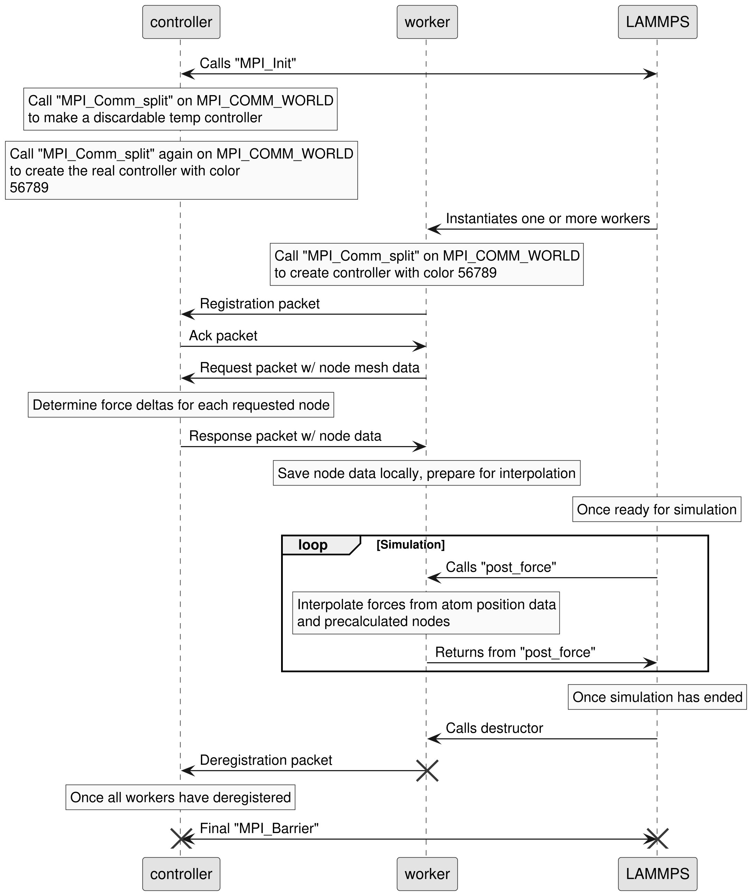
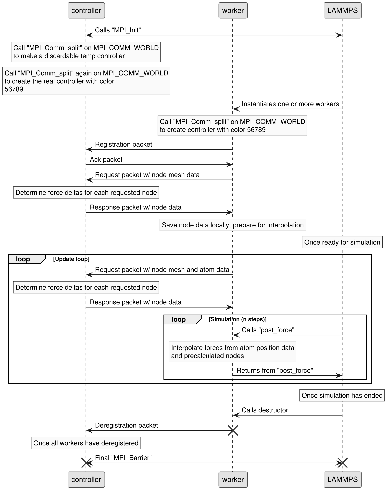

# ARBFN Internals

This document details how ARBFN works under the hood.

## `fix arbfn`


## `fix arbfn/ffield`

Without the `every n` argument:



With the `every n` argument:



**Note:** If an `ffield` controller's response packet includes
a numerical entry for the JSON key `"every"` (EG `"every": 9,`),
then that will be the number of timesteps before it asks again.
This means that the `every` keyword can change over the life
cycle of the simulation.

## Example Packets

Every LAMMPS thread will send this packet to the controller upon
instantiation.

```json
// Type: ffield or arbfn
// From: worker
// To: controller
{
    "type": "register"
}
```

To which the controller must respond:

```json
// Type: ffield or arbfn
// From: controller
// To: worker
{
    "type": "ack"
}
```

After this, the controller must await a request packet.
**If this is `fix arbfn`**, the form will be as follows.

```json
// Type: arbfn
// From: worker
// To: controller
{
    "type": "request",
    "expectResponse": 123.0, // Max ms we will await a response
    "atoms": [
        {
            "x": 1.0,
            "y": 1.0,
            "z": 1.0,
            "vx": 2.0,
            "vy": 2.0,
            "vz": 2.0,
            "fx": 0.0,
            "fy": 0.0,
            "fz": 0.0,
            // These will be included iff dipole is true
            "mux": 3.0,
            "muy": 3.0,
            "muz": 3.0
        }
        // All atoms will be listed here
    ]
}
```

The controller can then send zero or more waiting packets while
it computes.

```json
// Type: arbfn
// From: controller
// To: worker
{
    "type": "waiting"
}
```

After this, the controller must send a response.

```json
// Type: arbfn
// From: controller
// To: worker
{
    "type": "response",
    // In the same order as the request atoms
    "atoms": [
        {
            "dfx": 1.0,
            "dfy": 1.0,
            "dfz": 1.0,
        }
    ]
}
```

For `fix arbfn`, this cycle will repeat until a `deregister`
packet is sent to the controller (see later).
**If, instead, this is `fix arbfn/ffield`**, the following form
must be used.

```json
// Type: ffield
// From: worker
// To: controller
{
    "type": "gridRequest",
    // x_0, y_0, z_0
    "offset": [ 1.0, 2.0, 3.0 ],
    // The dx, dy, and dz between nodes
    "spacing": [ 0.1, 0.2, 0.3 ],
    // The number of NODES across in x, y, and z
    "nodeCounts": [ 101, 201, 301 ],
    // This part is optional
    "atoms": [
        // Just as in a fix arbfn request packet
    ]
}
```

After receiving a `gridRequest` packet, the controller has an
unlimited amount of time to prepare and send the following
response.

```json
// Type: ffield
// From: controller
// To: worker
{
    "type": "gridResponse",
    "nodes": [
        {
            // The x pos will be x_0 + xIndex * dx, etc.
            // Indexes should start at zero and end one less
            // than the nodeCount
            "xIndex": 123,
            "xIndex": 321,
            "xIndex": 101,
            // The prescribed force deltas to interpolate
            "dfx": 1.0,
            "dfx": 2.0,
            "dfx": 3.0
        },
        // The rest of the nodes must also follow
    ],
    // This part is optional
    "every": 100
}
```

**This is where `fix arbfn` and `fix arbfn/ffield` rejoin.**
After LAMMPS finishes simulation, the following packet will be
sent.

```json
// Type: ffield or arbfn
// From: worker
// To: controller
{
    "type": "deregister"
}
```

No response is needed. After all workers that initially
registered have deregistered, the controller should shut down.
