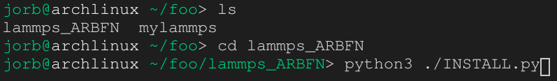
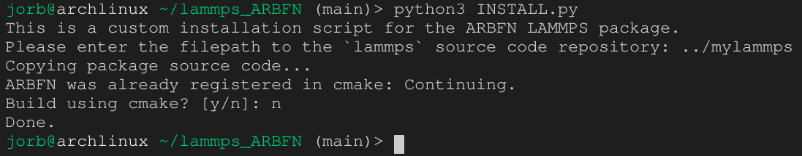

# Installation

**Note:** This guide is for `linux`. It doesn't matter what
distro, as we will not be using any package manager.

`ARBFN` is **not** included in standard versions of LAMMPS! In
order to install it, you will need to build LAMMPS from source
(**not** via a package manager). There are two traditional ways
to build LAMMPS from source: Via `make` (old-school), and via
`CMake` (slightly less old-school). This guide will walk through
how to build LAMMPS with the ARBFN package.

# Step 1: Get the LAMMPS Source Code

Change to a directory you don't mind using, then follow
**[this guide](https://docs.lammps.org/Install_git.html)** to
download the LAMMPS source code. We assume that you named your
source code directory `mylammps` (like the official guide did).

The following command output should be replicable.


# Step 2: Get the `ARBFN` Source Code

Next, download the ARBFN package source code from GitHub. This
guide will assume that you put said repo such that `ls .` lists
both `mylammps` and `lammps_ARBFN`.

One way to clone the ARBFN repo is via the following command.

```sh
git clone https://github.com/jorbDehmel/lammps_ARBFN
```

You can also download a ZIP of the code directly from that URL.
After cloning, the following command should be replicable.


# Step 3: Configuring the Build Process

LAMMPS is very specific in its build process. In order for a
package to be included in the built executable, it must be
copied to the `mylammps/src/` directory. Thus, for `ARBFN` to
be installed, we must copy the directory `./lammps_ARBFN/ARBFN`
to `./mylammps/src/ARBFN`. Furthermore, for `CMake` to detect
it, we must add `ARBFN` to the list of standard packages in
`./mylammps/cmake/CMakeLists.txt`.

Maintanance note: Despite being written in `C++`, LAMMPS can
only recognize `C`-style `.h` files, **not** the more idiomatic
`.hpp` file. If headers have the latter format, the build
process will fail.

To ease with the ARBFN install process,
**we provide an installation script:**
`./lammps_ARBFN/INSTALL.py`. This python program first asks for
the path to the LAMMPS source code relative to the current
directory.

**Note:** You must have write access to all of `mylammps`.
Otherwise, you will get a permission denied error.

**Note:** You must run `INSTALL.py` from within `lammps_ARBFN`:
Running `ls .` should list `INSTALL.py`. If you do not do this,
you will get a message about the `ARBFN` directory not existing
locally.



If you only want to configure the build process, just run the
script via `python3 ./INSTALL.py` and provide the relative
location of the LAMMPS source code, choosing `n` when it asks
whether you want to build using `CMake`.



If you instead say `y`, the script will do its best to build
LAMMPS and attempt to install it.
**This is best if you are new to building FOSS.** If you choose
`y` and it succeeds, you can skip the remaining steps. Note that
it may give a message about failing to copy `lmp` to `/usr/bin`
if you are not running as sudo.

# Step 4: Build a `lmp` Executable

## Method 1: `make`

```sh
cd mylammps/src
make purge
make yes-arbfn
# Any additional packages go here
make mpi
```

You can modify this series of commands for additional packages
as demonstrated
[here](https://docs.lammps.org/Build_package.html).

You can also cause the build process to use multiple threads by
replacing `make mpi` with `make mpi -j n`, where $n$ is the
number of threads.

## Method 2: `CMake`

If the installation script for ARBFN has been run without
building, the following commands will build a `lmp` executable.

```sh
cd mylammps
mkdir build
cd build
cmake -D PKG_ARBFN=ON -D BUILD_MPI=yes ../cmake
make
```

You can modify this series of commands for additional packages
as demonstrated
[here](https://docs.lammps.org/Build_package.html).

You can also cause the build process to use multiple threads by
replacing `make` with `make -j n`, where $n$ is the number of
threads.

# Step 5:

Now the executable `./lmp` will exist. If you used method 1, it
will be at `./mylammps/src/lmp`. If you used method 2 or the
installation script's auto-build, it will be at
`./mylammps/build/lmp`.

If you want to install it properly (so that `lmp foo.lmp` will
work rather than just `./lmp foo.lmp`), run

```sh
# Most distros require sudo to pase into /usr/bin
sudo cp ./lmp /usr/bin/lmp
```

Alternatively, if sudo is unavailable (EG on shared servers),
you can just move this executable wherever you need it.
