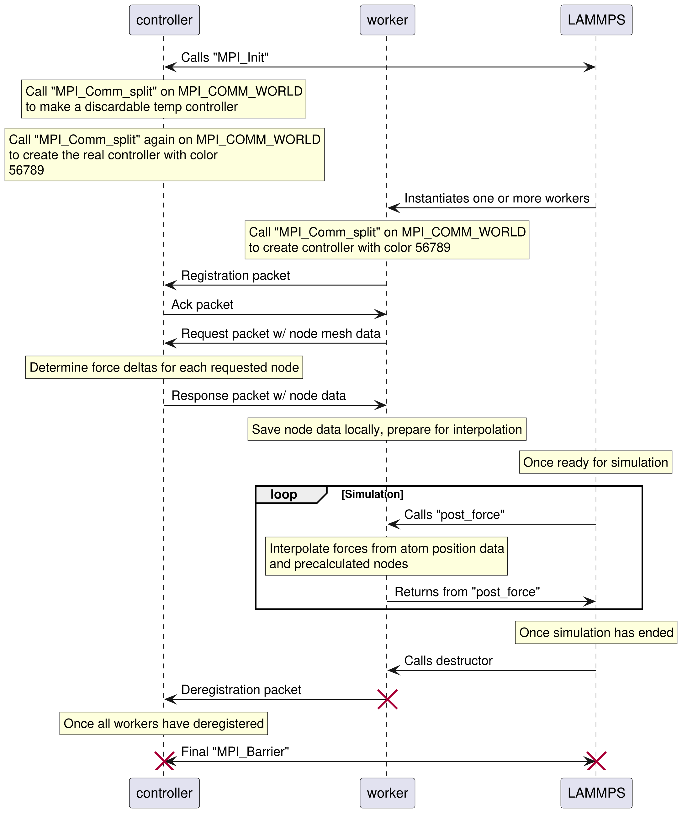
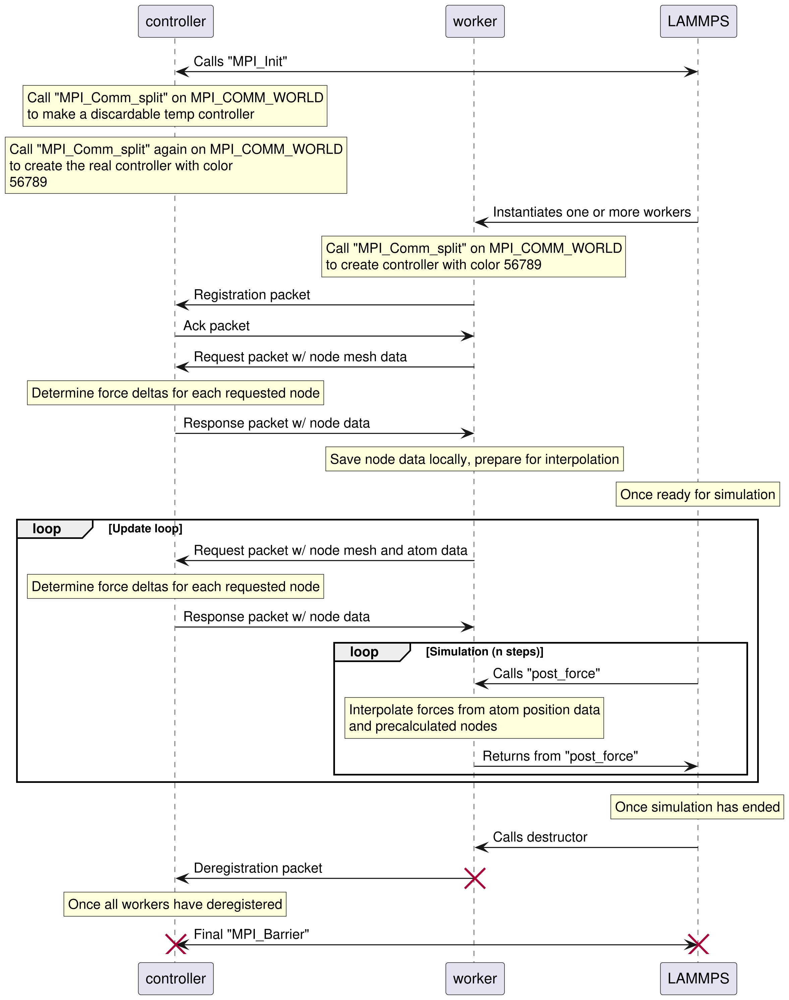
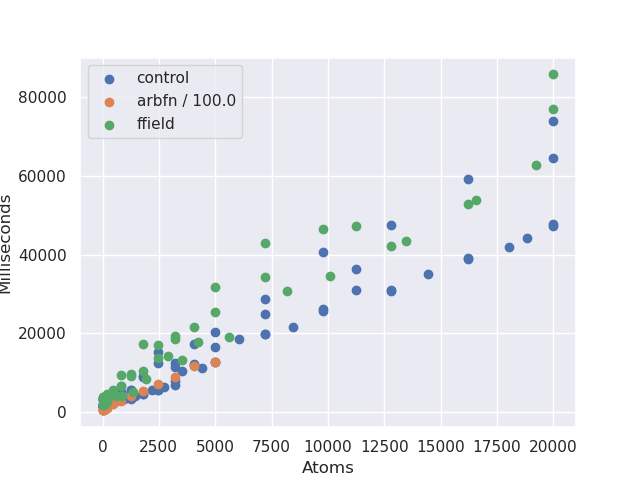

# Poster outline for the Spring '25 CMU Student Showcase

J Dehmel, J Schiffbauer

## Title

The ARBFN package: Externally Computed Forces in LAMMPS

## Abstract

The molecular dynamics simulation software LAMMPS provides a
scripting language for the easy implementation of experiments:
However, this language is not all-encompassing. There are many
situations in which LAMMPS alone is not sufficient and some
external computation must be used, for example, including
quantum effects and machine learning control of a simulation.
Such situations provide some interface for a specific program to
apply forces on the simulated particles. This project outlines
the development of a generic protocol for this process.
Specifically, we introduce an externally controlled atomic
forcing fix within the existing LAMMPS MPI framework. This
involves an arbitrary-language "controller" program being
instantiated alongside the simulation at runtime, then
communicating as needed. Results from test cases are shown.

## Intro to MD Simulation and Motivation

**TODO: WRITE THIS**

*(Note: Maybe an eye candy picture of LAMMPS here? Also this can
probably be stolen from old posters/presentations)*

## Parallelization and Synchronization

- A single simulation may be broken into some number of regions
- Each region may be handled by a different core or even machine
- In supercomputing settings (e.g. CU Boulder's Alpine cluster),
    the simulation is almost always broken across machines
- This is built-in to LAMMPS via MPI (Message Passing Interface)
- We can instantiate our controller on the same interface, being
    careful to isolate communication
- The controller can independently register each of the
    "workers" (which may or may not be on the same machine),
    then handling communication as needed
- MPI registration and deregistration compose the first and last
    steps of each protocol in the extension

## Protocol 1 (`fix arbfn`)

Every time step:

1. Send all atom data to the controller
2. Receive and apply individualized forces

## Protocol 2 (`fix arbfn/ffield`)

Once at the beginning:

1. Compute a grid over the simulation space
2. Get force interpolation points from the controller

Every time step:

1. Trilinearly interpolate the force deltas for every atom
2. Apply the interpolated forces

## Protocol 3 (`fix arbfn/ffield` w/ `every n`)

Once at the beginning:

1. Compute a grid over the simulation space
2. Get force interpolation points from the controller

Every $n$ time steps:

1. Send all atom data to the controller
2. Get force interpolation points from the controller
3. Update interpolation grid

Every time step:

1. Trilinearly interpolate the force deltas for every atom
2. Apply the interpolated forces

## Runtime Comparison

Using a set density and varying simulation box size to maintain
a fixed number of atom interactions:

Note: Since protocol 3 allows us to arbitrarily slow down
protocol 2, it does not make sense to include it here. It can
be viewed as a special case where `every 0` is (and therefore is
as fast as) protocol 2, `every 1` is about as slow as protocol
1, and any other `every n` is somewhere in between.

## Conclusion

We discussed the implementation of the `ARBFN` package for
LAMMPS, including a brief analysis of its performance as
simulations scaled. This package allows LAMMPS fixes which are
determined at runtime by arbitrary external "controllers",
either one-and-done (`arbfn/ffield`) or frame-by-frame
(`fix arbfn`). Initial testing shows that the former performs
nearly as well as unmodified LAMMPS, while the latter runs about
100 times worse slower. We also provided an option to update the
interpolation force field as a function of atom data
periodically throughout the simulation's life cycle.

## Future Work

- Large scale testing
- Implementation in more useful force fields (e.g. validating
    experimental data of our Florida partners)

## Acknowledgements

Supported by NSF grant **NUMBER GOES HERE**

Thanks to Colorado Mesa University
